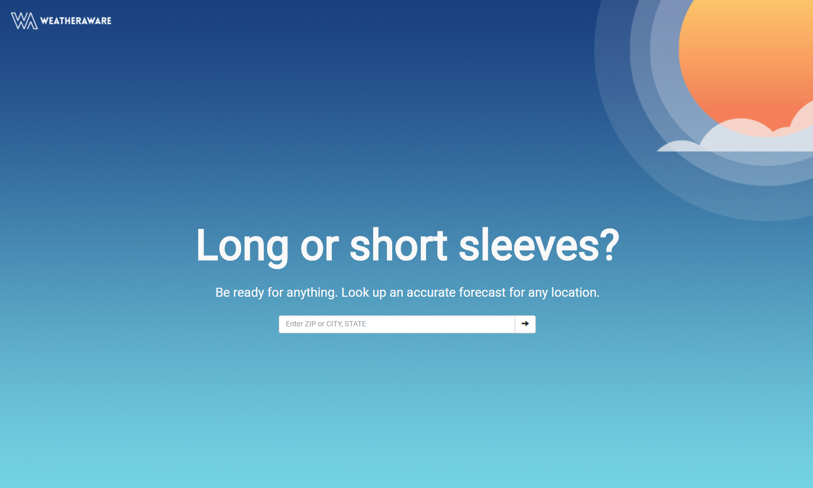
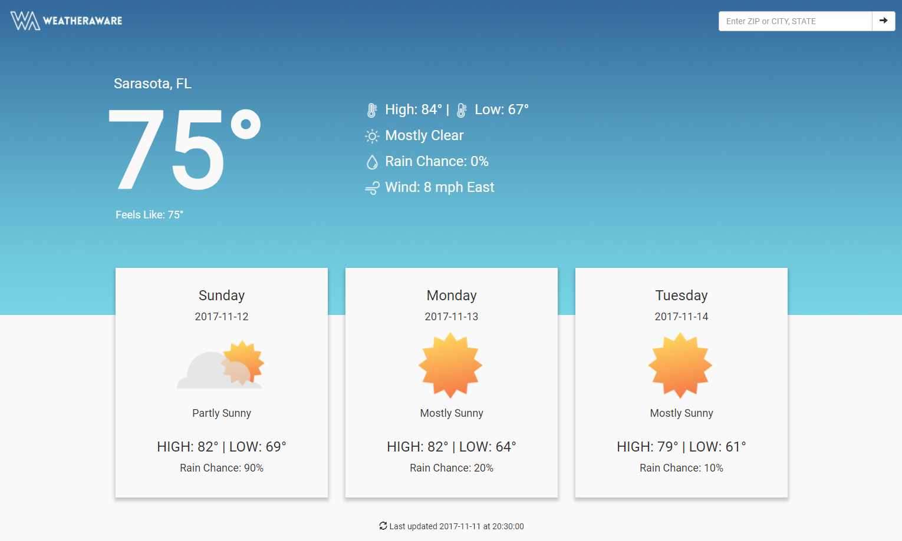

# WeatherAware

Not currently publicly hosted.

## Overview
This application utilizes the Weather.js NPM package to generate weather conditions and forecast data for the user upon request. Accepts Zip Codes as well as City, State/Country in order to look up the data. Dynamic images are used to accompany the data and make the project more appealing.

Team Members: **Ben Lacy**

Front End Technologies:

* Bootstrap 3.3.7
* JavaScript / jQuery
* AJAX

Back End Technologies:

* Node.js
* Express.js
* Weather.js

## Copyright
Ben Lacy (C) 2017. All Rights Reserved.
